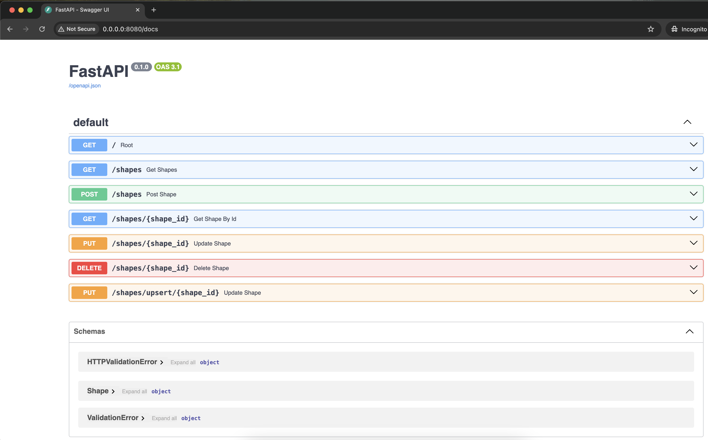
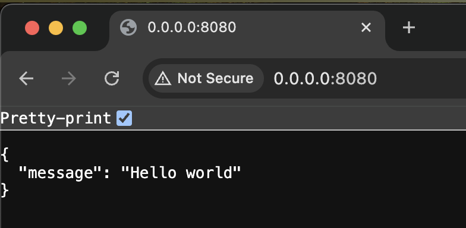

## Set venv:

* python3 -m venv venv
* source venv/bin/activate

## Install dependencies:

* pip install uvicorn
* pip install fastapi
* pip install mongita

## Run the app:

* uvicorn main:app --host "0.0.0.0" --port 8080 --reload

## Access the app:

* OpenAPI contract: http://0.0.0.0:8080/docs

* Sample GET: http://0.0.0.0:8080/

